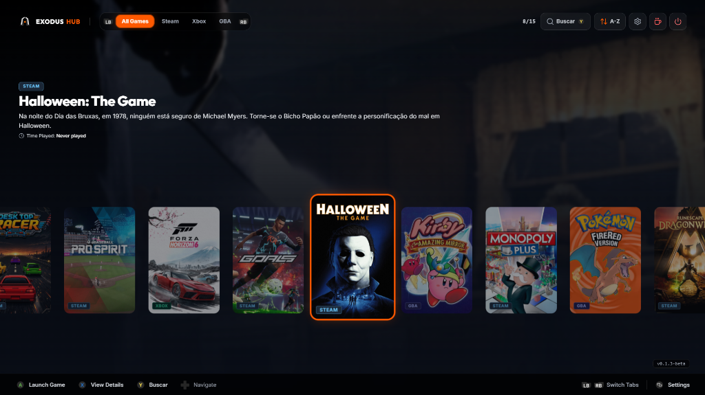
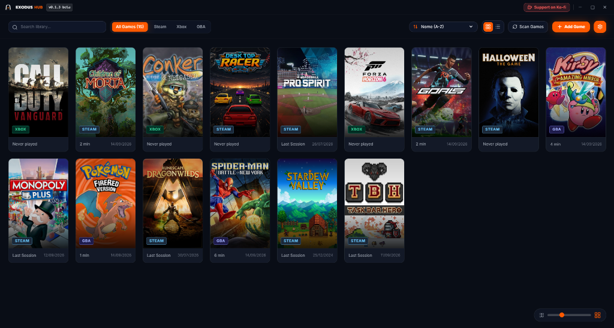
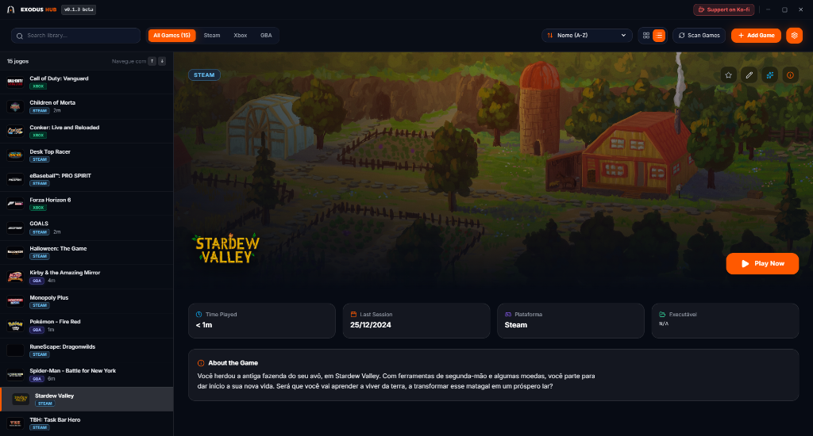

# 🎮 Exodus Hub

**The modern game launcher and frontend for PC, handhelds (ROG Ally, Legion Go, Steam Deck), and TV setups.**

[-blue.svg?style=for-the-badge&logo=windows)](https://github.com/henriquearsenio/exodus-hub/releases/latest)

 

### 📥 [Download Latest Release (v0.2.2-beta)](https://github.com/henriquearsenio/exodus-hub/releases/latest)

---

## ⚡ Downloads

| Package | File | Details |
|:---|:---|:---|
| 📦 **Installer (Recommended)** | [**Exodus-Hub-Setup-0.2.2-beta.exe**](https://github.com/henriquearsenio/exodus-hub/releases/download/v0.2.2-beta/Exodus-Hub-Setup-0.2.2-beta.exe) | Standard Windows installer with Start Menu & Desktop shortcuts. Includes **automatic update notifications**. |
| 💼 **Portable Version** | [**Exodus-Hub-Portable-0.2.2-beta.exe**](https://github.com/henriquearsenio/exodus-hub/releases/download/v0.2.2-beta/Exodus-Hub-Portable-0.2.2-beta.exe) | Standalone executable — run directly from any folder or USB drive with zero installation. |

---

## 💡 What is Exodus Hub?

Tired of having your games scattered across half a dozen different launchers and emulator folders? **Exodus Hub** unifies your entire collection into one beautiful, fast, and organized home.

No accounts to create, no passwords to link. Exodus Hub works locally by scanning your installed games directly on your PC.

Play the way you want with two specialized modes:

 

### 📺 1. Big Picture Mode (Couch & Handhelds)

A cinematic, controller-first interface built for gaming on your TV or Windows handhelds (**ASUS ROG Ally**, **Lenovo Legion Go**, **Steam Deck on Windows**, and mini-PCs). Navigate effortlessly with your gamepad, use the built-in on-screen keyboard, and configure your entire library — including artwork, custom collections, and emulators — without ever reaching for a mouse.

  

 

### 🖥️ 2. Desktop Mode (Mouse & Keyboard)

Designed for fast, organized library management. Switch freely between high-resolution cover posters or detailed list views:

| 🎨 Grid View (Poster Art) | 📋 List View (Backdrop & Details) |
| :---: | :---: |
|  |  |
| *Visual card grid with smooth cover zoom slider, high-res posters, and instant category filters.* | *Sidebar navigation, hero backdrop art, game synopsis, playtime tracking, and quick launch.* |

 

---

## ✨ Features

- 🎮 **All Your Launchers in One Place**:
  Automatically discovers your installed games from **Steam**, **Xbox / PC Game Pass**, **Epic Games Store**, **GOG Galaxy**, **EA App**, **Ubisoft Connect**, and **Battle.net**. You can also add any standalone PC game or executable (`.exe`).

- 🕹️ **Built-in Retro Emulator Presets**:
  One-click setup for 15+ popular emulators, including **RetroArch**, **PCSX2** (PS2), **Dolphin** (GameCube/Wii), **DuckStation** (PS1), **PPSSPP** (PSP), **RPCS3** (PS3), **Ryujinx** (Switch), **Cemu** (Wii U), **Xenia** (Xbox 360), **Citra / Lime3DS** (3DS), **MelonDS** (NDS), **mGBA** (GBA), **Vita3K** (PS Vita), **Flycast** (Dreamcast), and **MAME** (Arcade). Simply point to your emulator and ROMs folder.

- 🎨 **Automatic High-Resolution Artwork**:
  Download official vertical poster covers, hero backdrops, and logos via the integrated **SteamGridDB** scraper, or add your own custom images.

- 🎮 **Handheld & Controller Optimized**:
  - Full gamepad navigation for Xbox and PlayStation controllers.
  - Built-in On-Screen Keyboard (OSK) to search your library using a controller or touchscreen.
  - Automatic button glyph switching between Xbox and PlayStation styles.
  - Quick power menu to Sleep, Restart, or Shut Down directly from couch mode.

- 💎 **Modern Tactile Interface**:
  Refined industrial-inspired aesthetic with rich dark mode and true OLED black themes, custom accent colors, and smooth navigation throughout.

- ⚡ **Game Boost**:
  Automatically optimizes CPU priority when a game launches to help ensure maximum performance.

- 🔒 **100% Local & Private**:
  No sign-up, no login credentials, no analytics tracking, and no internet required to play your games.

- 🌐 **Multi-Language Support**:
  Fully localized in **English**, **Português (Brasil)**, and **Español**.

---

## ⌨️ Controls & Shortcuts

| Action | Controller (Xbox / ROG Ally) | Controller (PlayStation) | Keyboard |
|:---|:---:|:---:|:---:|
| **Launch Game / Select** | `A` | `✕` | `Enter` / `Space` |
| **Back / Close Window** | `B` | `○` | `Esc` |
| **Game Details** | `X` | `□` | Click Card |
| **Toggle Favorite** | `Y` | `△` | `F` |
| **Open Search (OSK)** | `Y` *(top bar)* | `△` *(top bar)* | `Ctrl + F` |
| **Switch Categories** | `LB` / `RB` | `L1` / `R1` | `Q` / `E` |
| **Toggle Big Picture / Desktop** | *Power Menu* | *Power Menu* | `F11` |

---

## 💻 System Requirements

* **Operating System**: Windows 10 (64-bit) or Windows 11.
* **Processor**: Modern 64-bit processor (Intel / AMD).
* **Memory**: 4 GB RAM.
* **Storage**: ~200 MB disk space for the application + storage for game artwork cache.

---

## ☕ Support the Project

Exodus Hub is completely free and independently developed. If you enjoy using it, you can support ongoing development on **Ko-fi**:

👉 **[ko-fi.com/exodushub](https://ko-fi.com/exodushub)**

---

Crafted for PC gamers by Henrique Arsenio.

